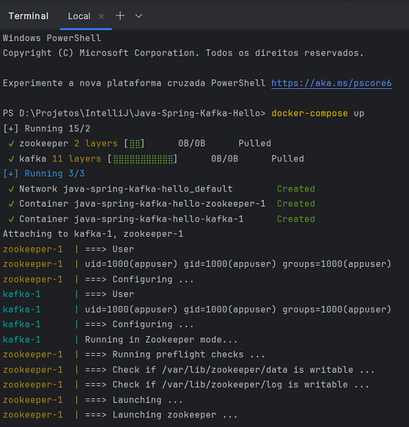

# Spring Kafka - Hello
Projeto em Java com Spring, Gradle e Kafka para criar uma aplicação produtora e consumidora de tópicos.


## Passos
Os passos da implementação do projeto:

1. Criar projeto (no IntelliJ) com:
- Linguagem Java (17);
- Spring Framework (6.2.3);
- Dependências: Web, Kafka, DevTools.


2. Configurar e executar o Kafka na máquina local com Docker:
- Criar o arquivo `docker-compose.yml`:

```yml
 version: '2'
services:
  zookeeper:
    image: confluentinc/cp-zookeeper:7.4.4
    environment:
      ZOOKEEPER_CLIENT_PORT: 2181
      ZOOKEEPER_TICK_TIME: 2000
    ports:
      - 22181:2181
  
  kafka:
    image: confluentinc/cp-kafka:7.4.4
    depends_on:
      - zookeeper
    ports:
      - 29092:29092
    environment:
      KAFKA_BROKER_ID: 1
      KAFKA_ZOOKEEPER_CONNECT: zookeeper:2181
      KAFKA_ADVERTISED_LISTENERS: PLAINTEXT://kafka:9092,PLAINTEXT_HOST://localhost:29092
      KAFKA_LISTENER_SECURITY_PROTOCOL_MAP: PLAINTEXT:PLAINTEXT,PLAINTEXT_HOST:PLAINTEXT
      KAFKA_INTER_BROKER_LISTENER_NAME: PLAINTEXT
      KAFKA_OFFSETS_TOPIC_REPLICATION_FACTOR: 1
```

- No terminal executar `docker-compose up`;




## Referências
Spring for Apache Kafka - Quick Tour:
https://docs.spring.io/spring-kafka/reference/quick-tour.html

Baeldung - Intro to Apache Kafka with Spring:
https://www.baeldung.com/spring-kafka

Introdução à Mensageria com Spring e Kafka - Giuliana Bezerra: 
https://www.youtube.com/watch?v=97TF2xZgAhU | https://github.com/giuliana-bezerra/messaging-springboot