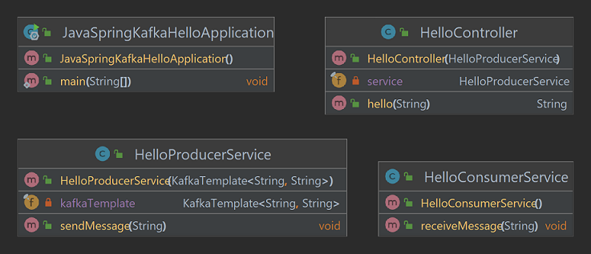

# Spring Kafka - Hello
Project in Java with Spring, Gradle and Kafka to create a topic producing and consuming application.




## Steps
The steps of project implementation:

1. Create project (in IntelliJ) with:
- Java language (17);
- Spring Framework (6.2.3);
- Dependencies: Web, Kafka, DevTools.


2. Configure and run Kafka on local machine with Docker:
- Create the `docker-compose.yml` file:

```yml
 version: '2'
services:
  zookeeper:
    image: confluentinc/cp-zookeeper:7.4.4
    environment:
      ZOOKEEPER_CLIENT_PORT: 2181
      ZOOKEEPER_TICK_TIME: 2000
    ports:
      - 22181:2181
  
  kafka:
    image: confluentinc/cp-kafka:7.4.4
    depends_on:
      - zookeeper
    ports:
      - 29092:29092
    environment:
      KAFKA_BROKER_ID: 1
      KAFKA_ZOOKEEPER_CONNECT: zookeeper:2181
      KAFKA_ADVERTISED_LISTENERS: PLAINTEXT://kafka:9092,PLAINTEXT_HOST://localhost:29092
      KAFKA_LISTENER_SECURITY_PROTOCOL_MAP: PLAINTEXT:PLAINTEXT,PLAINTEXT_HOST:PLAINTEXT
      KAFKA_INTER_BROKER_LISTENER_NAME: PLAINTEXT
      KAFKA_OFFSETS_TOPIC_REPLICATION_FACTOR: 1
```

- In the terminal run `docker-compose up`;


- Change `application.properties` to find Kafka:

```properties
spring.kafka.bootstrap-servers=localhost:29092
```

3. Create `HelloProducerService` class:
- annotated with `@Service`;
- with a `KafkaTemplate<String, String> kafkaTemplate` attribute;
- with a constructor with an argument;
- with a `void sendMessage(String message)` method;

4. Create `HelloConsumerService` class:
- annotated with `@Service`;
- with a method `@KafkaListener(topics = "hello-topic", groupId = "group-1") public void receiveMessage(String message)`;

5. Create `HelloController` class:
- annotated with `@RestController` and `@RequestMapping("/kafka")`;
- with a `HelloProducerService service` attribute;
- with a constructor with one argument and annotated with `@Autowired`;
- with a method `@GetMapping("/hello/{name}") public String hello(@PathVariable("name") String name)`;


## References
Spring for Apache Kafka - Quick Tour:
https://docs.spring.io/spring-kafka/reference/quick-tour.html

Baeldung - Intro to Apache Kafka with Spring:
https://www.baeldung.com/spring-kafka

Introdução à Mensageria com Spring e Kafka - Giuliana Bezerra:
https://www.youtube.com/watch?v=97TF2xZgAhU | https://github.com/giuliana-bezerra/messaging-springboot